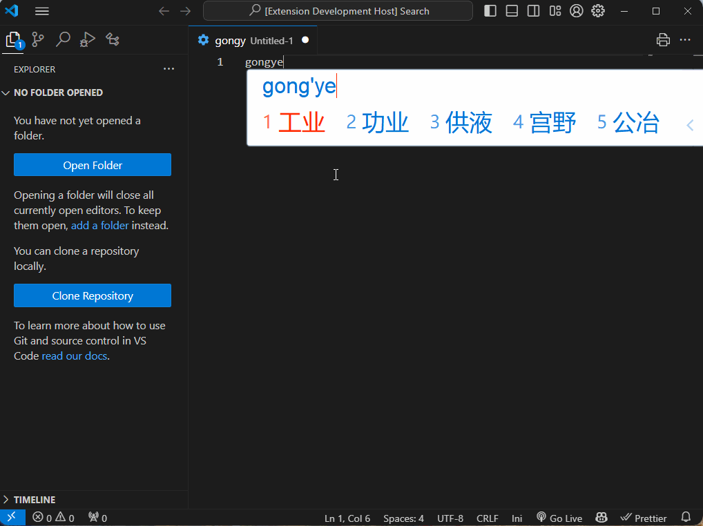

# 中文变量命名

根据选中的中文右键菜单进行变量命名



## Extension Settings

在VS Code 配置文件添加[百度翻译开放平台](https://fanyi-api.baidu.com/)的appid和secret

```json
    "chinese-variable-naming.appid": "your appid",
    "chinese-variable-naming.secret": "your secret",
```

## Known Issues

1. 网络不通？
   请关闭全局VPN


## For more information

有问题联系 <houengineer@outlook.com>

**Enjoy!**
